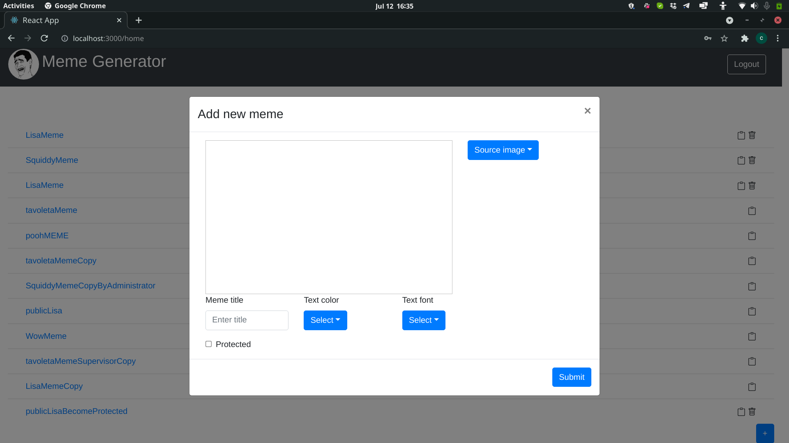
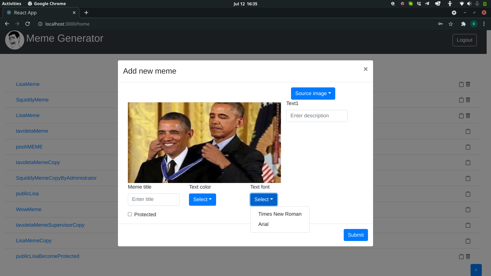
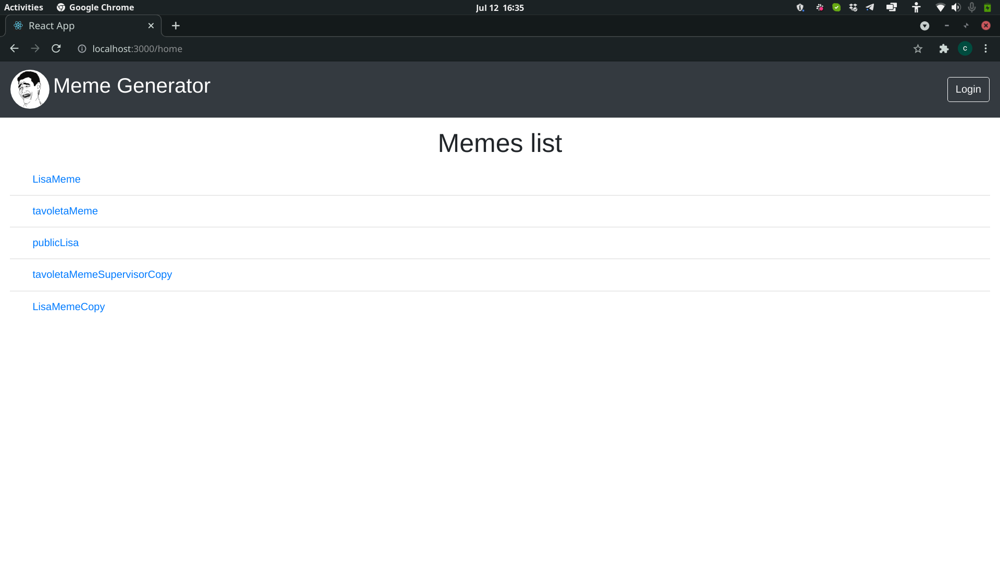
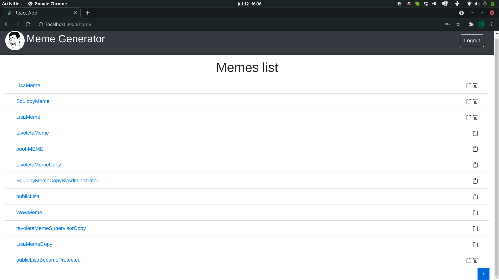

# Exam #2: "Meme generator"
## Student: Michelagnoli Cosimo 

## React Client Application Routes

- Route `/home`: show the list of memes inside the database, the content is different if you are an unrefistered user or if you logged in.
- Route `/login`: here there is the login form.
- Route `/meme:id`: here the route show the selected meme from the list, the id is the memeID inside the db.

## API Server

- POST `/api/sessions`
  - Request body: credentials of the user who is trying to login Request param: _None_
  - Response body: authenticated user
- GET `/api/sessions/current`
  - Request body: _None_ Request param: _None_
  - Response body: authenticated user
- DELETE `/api/sessions/current`
  - Request body: _None_ Request param: _None_
  - Response body: _None_
- POST `/api/meme/insert`
  - Request body: the object to be insert into the database Request param: _None_
  - Response body: the object as represented in the database   
- GET `/api/memes`
  - Request body: _None_ Request param: _None_
  - Response body: all the object into the database(meme table)
- GET `/api/public/memes`
  - Request body: _None_ Request param: _None_
  - Response body: a subset of the object into the database(meme table)
- GET `/api/allImages`
  - Request body: _None_ Request param: _None_
  - Response body: all the object into the database(images table)
- GET `/api/memes/images/:id`
  - Request body: _None_. Request param: the id of the object to be search.
  - Response body: the object retrived by the database, with the right id
- GET `/api/meme/delete/:id`
  - Request body: _None_. Request param: the id of the object to be deleted.
  - Response body: an empty object
  
## Database Tables

- Table `creators` - contains creatorID username password
- Table `images` - contains imageID name ntext position1 position2 position3
- Table `meme` - contains memeID title imageID color font ntext text1 text2 text3 protected creator

## Main React Components

- `MyNav` (in `Components.js`): navbar that show the name of the site, login/logout button 
- `LoginForm` (in `LoginComponents.js`): allow to an user to login
- `MyMain` (in `Components.js`): show the list of meme and allow to add, copy or delete meme
- `MyMeme` (in `Components.js`): show all the details of the meme selected

(only _main_ components, minor ones may be skipped)

## Screenshot

## Users Credentials

- admin, password 
   (LisaMeme,SquiddyMeme,LisaMeme,publicLisaBecomeProtected)
- administrator, password 
   (tavoletaMeme,poohMEME,tavoletaMemeCopy,SquiddyMemeCopyByAdministrator,publicLisa)
- supervisor, password
   (WowMeme,tavoletaMemeSupervisorCopy,LisaMemeCopy)
